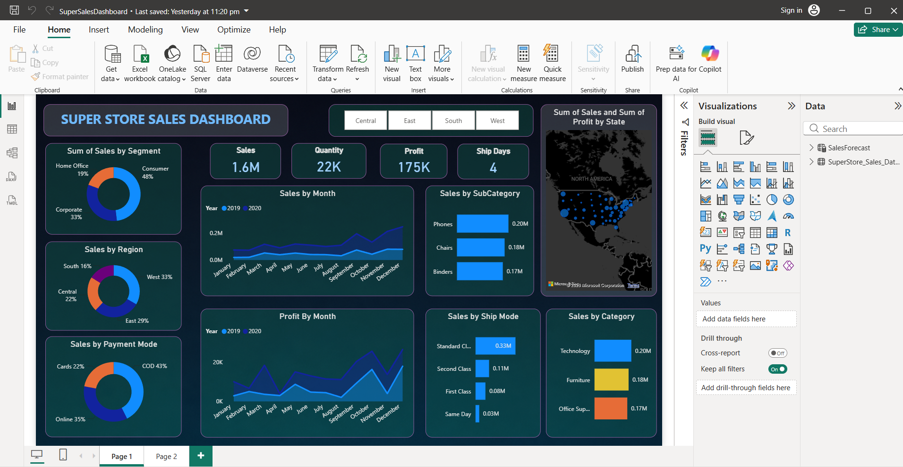
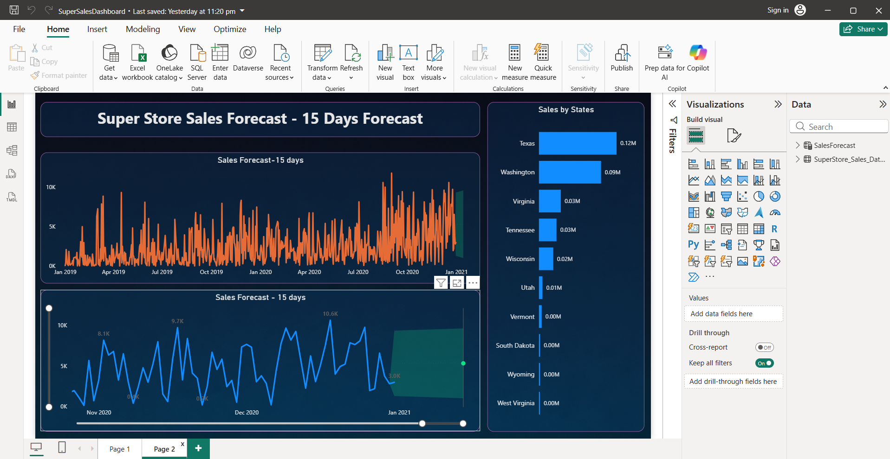

# 📊 Super Sales Dashboard

An interactive Power BI dashboard analyzing retail sales performance across the United States, built on the Superstore Sales dataset (2019–2020). The dashboard tracks revenue, profit, and quantity trends across regions, categories, and payment modes, and includes a 15-day sales forecast.



## 🎯 Objective
To transform raw transactional sales data into an interactive, decision-ready dashboard that surfaces performance trends across products, regions, and customer segments — enabling faster, data-driven business decisions.

## 📁 Dataset
**Source:** `SuperStore_Sales_Dataset.csv`
- **Records:** 5,901 transactions
- **Time period:** Jan 2019 – Dec 2020
- **Customers:** 773 unique customers across 49 states
- **Fields:** Order ID, Order Date, Ship Date, Ship Mode, Customer, Segment, Region, State, Category, Sub-Category, Sales, Quantity, Profit, Payment Mode

## 🛠️ Tech Stack
- **Power BI Desktop** — dashboard development
- **Power Query** — data cleaning & transformation
- **DAX** — custom measures (Sales, Profit, Quantity, Avg. Delivery Days)

## 📈 Dashboard Pages

### Page 1 — Sales Overview
- KPI cards: Total Sales, Quantity, Profit, Avg. Ship Days
- Sales by Category, Sub-Category, and Ship Mode
- Monthly Sales & Profit trend (stacked area charts)
- Geographic sales distribution (map)
- Sales by Payment Mode and Region (donut charts)


### Page 2 — Sales Forecast
- 15-day sales forecast using Power BI's built-in trend forecasting
- Sales by State breakdown



## 🔍 Key Insights
- Total sales of **$1.57M** with a profit of **$175K** across 22,317 units sold
- The **West region** leads in sales (**$522K**), followed by East ($450K), Central ($341K), and South ($252K)
- **Office Supplies** is the top-performing category (**$644K** in sales), ahead of Technology ($471K) and Furniture ($452K)
- **Cash on Delivery (COD)** is the most used payment mode by sales value ($667K), followed by Online ($554K) and Cards ($344K)

## 🚀 How to Use
1. Clone this repository
```bash
   git clone https://github.com/ashgithub0208/Super-Sales-Dashboard.git
```
2. Open `SuperSalesDashboard.pbix` in **Power BI Desktop**
3. If prompted, point the data source to `SuperStore_Sales_Dataset.csv` in this repo
4. Refresh the data model to load the latest values

## 📌 Future Improvements
- Add customer segmentation (RFM analysis)
- Extend forecast horizon with confidence intervals
- Add drill-through pages for product-level detail

## 👤 Author
**Ashmit Srivastava**
[LinkedIn](https://linkedin.com/in/ashmit-srivastava0208) • [GitHub](https://github.com/ashgithub0208)
